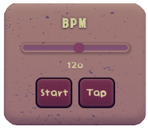
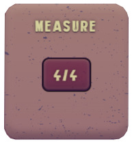
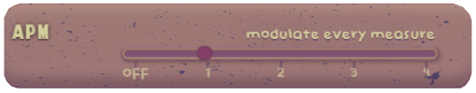

<a name="readme-top"></a>

[![Contributors][contributors-shield]][contributors-url]
[![Forks][forks-shield]][forks-url]
[![Stargazers][stars-shield]][stars-url]


<!-- PROJECT LOGO -->
<br />
<div align="center">
  <a href="https://github.com/armandoboemio/i-am-groove">
    
  </a>

<h3 align="center">I AM GROOVE</h3>

  <p align="center">
    Drum machine with custom recorded sounds and automated pattern generation    <br />
    <a href="https://github.com/armandoboemio/i-am-groove"><strong> Code »</strong></a>
    <br />
    <br />
    <a href="https://github.com/armandoboemio/i-am-groove">View Demo</a>
    ·
    <a href="https://github.com/armandoboemio/i-am-groove/issues">Report Bug</a>
    ·
    <a href="https://github.com/armandoboemio/i-am-groove/issues">Request Feature</a>
  </p>
</div>


<!-- TABLE OF CONTENTS -->
<details>
  <summary>Table of Contents</summary>
  <ol>
    <li>
      <a href="#about-the-project">About The Project</a>
      <ul>
        <li><a href="#built-with">Built With</a></li>
      </ul>
    </li>
    <li>
      <a href="#getting-started">Getting Started</a>
      <ul>
        <li><a href="#prerequisites">Prerequisites</a></li>
        <li><a href="#installation">Installation</a></li>
      </ul>
    </li>
    <li><a href="#usage">Usage</a></li>
    <li><a href="#implementation">Implementation</a></li>
    <li><a href="#pattern-generation">Pattern Generation</a></li>
    <li><a href="#contacts">Contacts</a></li>
  </ol>
</details>


<!-- ABOUT THE PROJECT -->
## About The Project


**I Am Groove** is an automated drum machine that allows you to record your own drum hits using your microphone. You can either choose to build the drum pattern or have it automatically generated using different levels of complexity. Add more unpredictability to your pattern using our APM (Automatic Pattern Modulation) and tweak the parameters on the fly to surprise your listeners. 

[![Main-screen]](https://github.com/ArmandoBoemio/I-am-Groove)

Remember, **YOU are groove**! 

<p align="right">(<a href="#readme-top">back to top</a>)</p>


### Built With

* [![React][React.js]][React-url]
* [![Flask][Flask.com]][Flask-url]

<p align="right">(<a href="#readme-top">back to top</a>)</p>


<!-- GETTING STARTED -->
## Getting Started

Follow the steps below to download, setup and run the app locally.

### Prerequisites

Before running, you will need the following:
* Node.js
  ```sh
   https://nodejs.org/en/download/
  ```

* python 3.x (3.7 or **above** recommended)
    ```sh
    https://www.python.org/downloads/
    ```

### Installation

1. Clone the repo
   ```sh
   git clone https://github.com/armandoboemio/i-am-groove.git
   ```
3. Install NPM packages
   ```sh
   cd client
   npm install
   ```
4. Install python libraries
   ```sh
   cd server
   pip install -r requirements.txt
   ```

### Startup

1. Run Flask
   ```sh
   cd server
   flask run
   ```
2. Run NPM
   ```sh
   cd client
   npm start
   ```

<p align="right">(<a href="#readme-top">back to top</a>)</p>


<!-- USAGE EXAMPLES -->
## Let's get groovy

The user can tweak the parameters to get different rhytmic grooves and patterns.

### BPM



It is possible to choose the BPM of the drum machine using the slider or the tap tempo button. Take it _groovy_ at **50 bpm** or go _crazy fast_ up to **180 bpm** . Press the button **Start** to play the metronome at the chosen BPM.


### Measure



Click on the button to open the dropdown and decide among different available measures. Both even and odd time signatures are included, from **2/4** to **7/4**.


### APM



APM stands for **Automatic Pattern Modulation**. Move across the slider to select if and when a new pattern is generated. The modulation can happean at each new measure or up to after 4 measures.


### Complexity


Move across the slider to obtain simple patterns (low complexity) or very intricated patterns (high complexity). This parameter determines the number of metric subdivisions in a single measure, from **1/4** notes to **1/32** notes and the unpredictability of the pattern.


### Instrument Panel


Each row corresponds to a different drum hit (Kick - Snare - Hi Hat - Cowbell). The app starts already with four stock sounds. Record your own sounds using the **Record** button. Click **User/Default** to swap between the recorded sound and the stock drum hit. Press **Play** to hear what you recorded or the stock drum hit. 

### Grid


I am drum machine! Click on **Generate** to create a new drum pattern, modify it by switching on/off the cells and _start groovin'_ with the **Play** button.


<p align="right">(<a href="#readme-top">back to top</a>)</p>


<!-- IMPLEMENTATION -->
## Implementation

qui mettiamo qualche cosa del codice, tipo qualche schema diagramma cose
<p align="right">(<a href="#readme-top">back to top</a>)</p>

<!-- PATTERN GENERATION -->
## Pattern Generation

pattern aaaaaaaaaaaaaaaaaaaaa
<p align="right">(<a href="#readme-top">back to top</a>)</p>


<!-- CONTACTS -->
## Contacts

Armando Boemio - armando.boemio@mail.polimi.it

Filippo Gualtieri - filippo.gualtieri@mail.polimi.it

Gabriele Maucione - gabriele.maucione@mail.polimi.it


* Project Link: [https://github.com/armandoboemio/i-am-groove](https://github.com/armandoboemio/i-am-groove)

<p align="right">(<a href="#readme-top">back to top</a>)</p>


<!-- MARKDOWN LINKS & IMAGES -->
<!-- https://www.markdownguide.org/basic-syntax/#reference-style-links -->
[contributors-shield]: https://img.shields.io/github/contributors/othneildrew/Best-README-Template.svg?style=for-the-badge
[contributors-url]: https://github.com/othneildrew/Best-README-Template/graphs/contributors
[forks-shield]: https://img.shields.io/github/forks/othneildrew/Best-README-Template.svg?style=for-the-badge
[forks-url]: https://github.com/othneildrew/Best-README-Template/network/members
[stars-shield]: https://img.shields.io/github/stars/othneildrew/Best-README-Template.svg?style=for-the-badge
[stars-url]: https://github.com/othneildrew/Best-README-Template/stargazers

[React.js]: https://img.shields.io/badge/React-20232A?style=for-the-badge&logo=react&logoColor=61DAFB
[React-url]: https://reactjs.org/
[Flask.com]: https://img.shields.io/badge/Flask-grey?style=for-the-badge&logo=flask&logoColor=white
[Flask-url]: https://flask.palletsprojects.com/en/2.2.x/
[Main-screen]: images/mainscreen.png