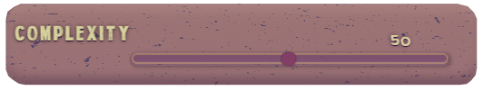

<a name="readme-top"></a>

[![Contributors][contributors-shield]][contributors-url]
[![Forks][forks-shield]][forks-url]
[![Stargazers][stars-shield]][stars-url]


<!-- PROJECT LOGO -->
<br />
<div align="center">
  <a href="https://github.com/armandoboemio/i-am-groove">
    
  </a>

<h3 align="center">I Am Groove</h3>

  <p align="center">
    Drum machine with custom recorded sounds and automated pattern generation    <br />
    <a href="https://github.com/armandoboemio/i-am-groove"><strong> Code »</strong></a>
    <br />
    <br />
    <a href="https://github.com/armandoboemio/i-am-groove">View Demo</a>
    ·
    <a href="https://github.com/armandoboemio/i-am-groove/issues">Report Bug</a>
    ·
    <a href="https://github.com/armandoboemio/i-am-groove/issues">Request Feature</a>
  </p>
</div>


<!-- TABLE OF CONTENTS -->
<details>
  <summary>Table of Contents</summary>
  <ol>
    <li>
      <a href="#about-the-project">About The Project</a>
      <ul>
        <li><a href="#built-with">Built With</a></li>
      </ul>
    </li>
    <li>
      <a href="#getting-started">Getting Started</a>
      <ul>
        <li><a href="#prerequisites">Prerequisites</a></li>
        <li><a href="#installation">Installation</a></li>
        <li><a href="#startup">Startup</a></li>
      </ul>
    </li>
    <li><a href="#lets-get-groovy">Let's Get Groovy</a></li>
    <ul>
        <li><a href="#bpm">BPM</a></li>
        <li><a href="#measure">Measure</a></li>
        <li><a href="#apm">APM</a></li>
        <li><a href="#complexity">Complexity</a></li>
        <li><a href="#sound-control">Sound Control</a></li>
        <li><a href="#performance-panel">Performance Panel</a></li>        
    </ul>
    <li><a href="#implementation">Implementation</a></li>
    <ul>
        <li><a href="#front-end">Front-end</a></li>
        <li><a href="#back-end">Back-end</a></li>
    </ul>
    <li><a href="#pattern-generation">Pattern Generation</a></li>
    <li><a href="#contacts">Contacts</a></li>
  </ol>
</details>


***
<!-- ABOUT THE PROJECT -->
## About The Project


**I Am Groove** is an automated drum machine that allows you to record your own drum hits using your microphone. You can either choose to build the drum pattern or have it automatically generated using different levels of complexity. Add more unpredictability to your pattern using our APM (Automatic Pattern Modulation) and tweak the parameters on the fly to surprise your listeners. 

[![Main-screen]](https://github.com/ArmandoBoemio/I-am-Groove)

Remember, **YOU are groove**! 

<p align="right">(<a href="#readme-top">back to top</a>)</p>


### Built With

* [![React][React.js]][React-url]
* [![Flask][Flask.com]][Flask-url]

<p align="right">(<a href="#readme-top">back to top</a>)</p>


***
<!-- GETTING STARTED -->
## Getting Started

Follow the steps below to download, setup and run the app locally.

### Prerequisites

Before running, you will need the following:
* Node.js
  ```sh
   https://nodejs.org/en/download/
  ```

* python 3.x (3.7 or **above** recommended)
    ```sh
    https://www.python.org/downloads/
    ```

### Installation

1. Clone the repo
   ```sh
   git clone https://github.com/armandoboemio/i-am-groove.git
   ```
3. Install NPM packages
   ```sh
   cd client
   npm i
   ```
4. Install python libraries
   ```sh
   cd server
   pip install -r requirements.txt
   ```

### Startup

1. Run Flask
   ```sh
   cd server
   flask run
   ```
2. Run NPM
   ```sh
   cd client
   npm start
   ```

<p align="right">(<a href="#readme-top">back to top</a>)</p>


***
<!-- USAGE EXAMPLES -->
## Let's Get Groovy

The user can tweak the parameters to get different rhytmic grooves and patterns.

### BPM


It is possible to choose the BPM of the drum machine using the slider or the tap tempo button. Take it _groovy_ at **50 bpm** or go _crazy fast_ up to **180 bpm** . Press the button **Start** to play the metronome at the chosen BPM.


### Measure


Click on the button to open the dropdown and decide among different available measures. Both even and odd time signatures are included, from **2/4** to **7/4**.


### APM


APM stands for **Automatic Pattern Modulation**. Move across the slider to select if and when a new pattern is generated. The modulation can happen at each new measure or up to after 4 measures.


### Complexity



Move across the slider to obtain simple patterns (low complexity) or very intricated patterns (high complexity). This parameter determines the unpredictability of the pattern and the number of metric subdivisions in a single measure, from **1/8** notes to **1/32** notes.

**WARNING!!!** Extreme levels of complexity may lead to dizziness, headaches, ear bleeding. Better pair it with slow bpm.


### Sound Control


Each row corresponds to a different drum hit (Kick - Snare - Hi Hat - Cowbell). The app starts already with four stock sounds. Record your own sounds using the **Record** button. Click **User/Default** to swap between the recorded sound and the stock drum hit. Press **Play** to hear what you recorded or the stock drum hit. 

### Performance Panel


I am drum machine! Click on **Generate** to create a new drum pattern, modify it by switching on/off the cells and _start groovin'_ with the **Play** button.


<p align="right">(<a href="#readme-top">back to top</a>)</p>

***
<!-- IMPLEMENTATION -->
## Implementation

The app has been realized using a *front-end + back-end* approach.


### Front-end
The front-end or <a href="https://github.com/ArmandoBoemio/I-am-Groove/blob/Release/client">client</a> is realized using the React framework. The client is composed by a main and different modules. Each sub-window function is defined as a component. 


<ul>
<li>
The <a href="https://github.com/ArmandoBoemio/I-am-Groove/blob/Release/client/src/app.js">app component</a> handles most of the GUI elements and state parameters updates. Here the <code>POST</code> method to send the state to the back-end and the trigger for new pattern generations are defined. From here the state is passed to child components as props. Finally, the play-pause functions are also handled within this component.
</li>
<li>
The <a href="https://github.com/ArmandoBoemio/I-am-Groove/blob/Release/client/src/components/SoundChannel.js">sound channel component</a> handles everything that happens into a single instrument row. It has two main sub-modules:
</li>
<ul>
<li>
<a href="https://github.com/ArmandoBoemio/I-am-Groove/blob/Release/client/src/components/SoundControl.js">SoundControl</a> handles the functions for the record, play/pause and default/user buttons. Each channel is defined by an ID and so are the audio associated to each of them. In particular, the audio is recorded using the <code>mediaRecorder</code> library and each time a new audioBlob is generated, it is sent to the back-end for further processing. Moreover, once the audio is received from the back-end, the channel is automatically set as 'User'. The play function allows to hear either the default or the user sound, depending on which one is selected.
</li>
<li>
<a href="https://github.com/ArmandoBoemio/I-am-Groove/blob/Release/client/src/components/SingleCell.js">SingleCell</a> handles the behaviour of the drum hits in the grid. Every cell is characterized by a channel id and a position id. Together they define the position of the cell in the grid. A counter iterates over all the positions. When it matches the id of an active cell, the associated sound is reproduced by the cell itself. It is finally possible to customize the given pattern, as the cell is switched active/inactive when clicked.
</li>
</ul>
</ul>

### Back-end
The back-end or <a href="https://github.com/ArmandoBoemio/I-am-Groove/blob/Release/server">server</a> is written in python using the micro-framework Flask. Here all the heavy-weight computation is done. In particular, the pattern generation and sound processing are done in this phase. The <a href="https://github.com/ArmandoBoemio/I-am-Groove/blob/Release/server/api.py">API</a> setups the routes to receive and send (<code>GET</code> and <code>POST</code> methods) the commands from the front-end. 
<ul>
<li>
The state parameters (<code>bpm</code>, <code>measure</code>, <code>APM</code>, <code>complexity</code>) are received at each update and are used for the generation of the pattern. The whole state is continuously saved and updated to make it available everywhere and always.
</li>
<li>
Each audio recording is received as an audio Blob, converted into a .wav file, trimmed using the <code>librosa.trim</code> function and stored for further use. This step is fundamental for a correct behaviour as a drum hit, since the recordings always exhibit even few milliseconds of silence at the start and at the end of it. In this way the attack of the drum hit is preserved.
</li>
<li>
The pattern is generated using a custom <a href="https://github.com/ArmandoBoemio/I-am-Groove/blob/Release/server/pattern_function.py">pattern generation function</a> and sent back to the front-end as a sequence of boolean strings, whose length and values depend on measure and complexity. The generation mechanism is further explained in the <a href="#pattern-generation">dedicated section</a>.
</li>
</ul>

<p align="right">(<a href="#readme-top">back to top</a>)</p>

***
<!-- PATTERN GENERATION -->
## Pattern Generation

The pattern generation is a very complicated system of levers and mirrors.

The pattern is thought to be paired with the declared four instruments. It consists of a two-dimensional array, where each row is associated with a drum hit. A sequence is thus generated according to specific rules that usually apply to its associated instrument. Its length depends on the time signature and on the complexity value. In particular, the complexity defines the metric quantum (tatum). The lower its value, the smaller the subdivision of the tactus.  

All the rules are probability based. 
The complexity value defines the likelihood to have a drum hit in a given position. Low complexity generally implies simple patterns, as drum hits will be limited in number and will not occur in irregular positions. On the other hand, high complexity implies a greater number of active cells and a higher probability of having them offset with respect to the beat.
Different approaches are used for different instruments.

<ul>
<li> Kick and snare are the most important instruments for the groove's intellegibility. Their positions, as a matter of fact, are the ones that define the beat. Therefore, their generation rules are stricter with respect to the other two instruments. The kick has however slightly more variability. Nonetheless, increasing complexity can still lead to unpredictable patterns. </li>

<li> Hi hat and bell have more variability even at low complexity values. Their generation rules rely on a Markov Chain approach.
By analizing the most common music genres, variable cymbals patterns can be found, from simple to very complex ones. This natural variability is something important that we need to take into account. At the same time modelling musical aspects like rhythms require a certain degree of consciousness of the context. Markov Chains were in focus with these requirements since they provide a controllable degree of variability, but they can also be aware of the generated pattern provided that the order is high enough.

Our implementation consists in a first order 3 state Markov Chain:
- Silence
- Instrument1
- instrument2

The chain is initialized according to a uniform probability, then all the possible transition probabilities are computed to form the *transition probability matrix*.
Transition probability matrices are chosen for low complexity values so that events are more likely to be simple and repetitive while, for high complexities, matrices are chosen to be more sparse so that the randomicity of the output raises.

</li>
</ul>


<p align="right">(<a href="#readme-top">back to top</a>)</p>


***
<!-- CONTACTS -->
## Contacts

Armando Boemio - armando.boemio@mail.polimi.it

Filippo Gualtieri - filippo.gualtieri@mail.polimi.it

Gabriele Maucione - gabriele.maucione@mail.polimi.it


* Project Link: [https://github.com/armandoboemio/i-am-groove](https://github.com/armandoboemio/i-am-groove)

<p align="right">(<a href="#readme-top">back to top</a>)</p>


<!-- MARKDOWN LINKS & IMAGES -->
<!-- https://www.markdownguide.org/basic-syntax/#reference-style-links -->
[contributors-shield]: https://img.shields.io/github/contributors/armandoboemio/i-am-groove.svg?style=for-the-badge
[contributors-url]: https://github.com/armandoboemio/i-am-groove/graphs/contributors

[forks-shield]: https://img.shields.io/github/forks/armandoboemio/i-am-groove.svg?style=for-the-badge
[forks-url]: https://github.com/armandoboemio/i-am-groove/network/members

[stars-shield]: https://img.shields.io/github/stars/armandoboemio/i-am-groove.svg?style=for-the-badge
[stars-url]: https://github.com/armandoboemio/i-am-groove/stargazers

[React.js]: https://img.shields.io/badge/React-20232A?style=for-the-badge&logo=react&logoColor=61DAFB
[React-url]: https://reactjs.org/
[Flask.com]: https://img.shields.io/badge/Flask-grey?style=for-the-badge&logo=flask&logoColor=white
[Flask-url]: https://flask.palletsprojects.com/en/2.2.x/
[Main-screen]: images/mainscreen.png
